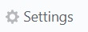
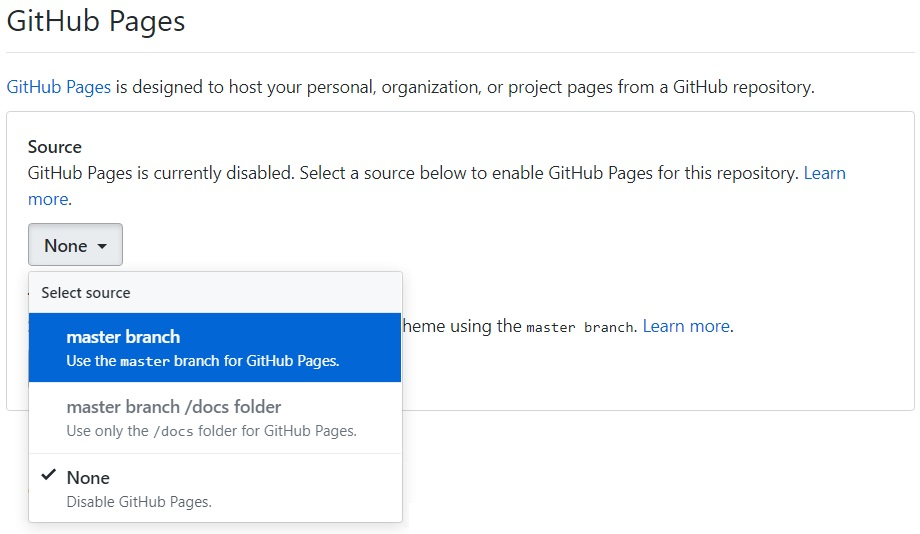
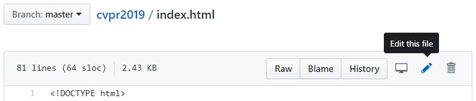
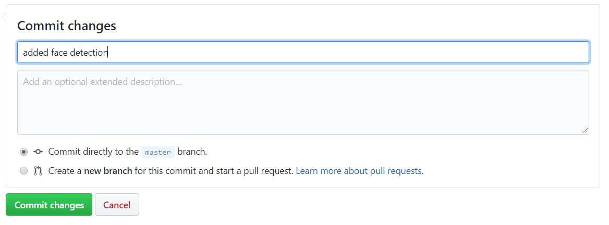

## Deep learning with OpenCV in the browser. CVPR 2019 workshop materials

In this repository you may find an example of how to run face detection deep learning network in browser using OpenCV. There are two branches: [master](https://github.com/dkurt/cvpr2019/tree/master) with initial template which just shows frames from camera and [complete](https://github.com/dkurt/cvpr2019/tree/complete) with working example.

Follow this guide to create your own GitHub Page with this example.

1. Fork this repo (you need to have GitHub account)

    

2. Go to "Settings" and find "GitHub Pages" section. Choose `master` branch as GitHub Pages source. Go to `https://<your_username>.github.io/cvpr2019/` to check initial version of example.

    

    

3. Go to you fork `https://github.com/<your_username>/cvpr2019`. Open `index.html` file in edit mode:

    

4. After frame reading, `cap.read(frame);` add the following code:

    Convert RGBA input frame to BGR:

    ```js
    cv.cvtColor(frame, frameBGR, cv.COLOR_RGBA2BGR);
    ```

    Create an input 4D blob. You may vary input resolution (width and height) to balance between efficiency and accuracy.

    ```js
    var blob = cv.blobFromImage(frameBGR, 1, {width: 192, height: 144}, [104, 117, 123, 0]);
    ```

    Put input blob to the network and do forward pass:

    ```js
    net.setInput(blob);
    var out = net.forward();
    ```

    Network produces output blob with shape `1x1xNx7` where `N` is a maximal number of detections and every detection is a vector `[batchId, classId, confidence, left, top, right, bottom]`. Iterate over predictions and draw ones with confidence > 50%:

    ```js
    for (var i = 0, n = out.data32F.length; i < n; i += 7) {
      var confidence = out.data32F[i + 2];
      if (confidence < 0.5)
        continue;
      var left = out.data32F[i + 3] * frame.cols;
      var top = out.data32F[i + 4] * frame.rows;
      var right = out.data32F[i + 5] * frame.cols;
      var bottom = out.data32F[i + 6] * frame.rows;
      cv.rectangle(frame, {x: left, y: top}, {x: right, y: bottom}, [0, 255, 0, 255]);
    }
    ```

    Do not forget to explicitly release allocated memory:

    ```js
    blob.delete();
    out.delete();
    ```

5. Save the changes as commit:

    

6. Wait several seconds to let GitHub update your Page and go again to `https://<your_username>.github.io/cvpr2019/` to see detection process.
